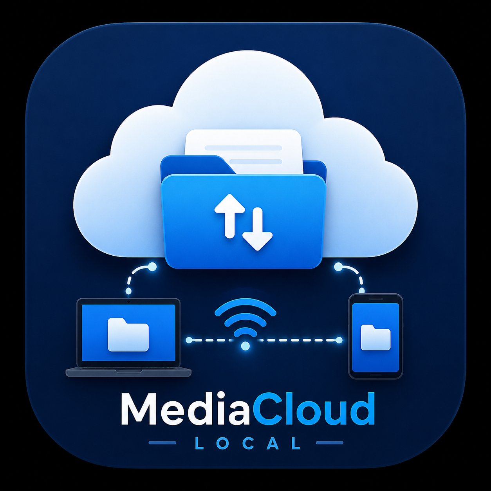

# 📦 Media Cloud Local

Hello and welcome to Media Cloud Local.

---

# ⚙️ Application Requirements

- Termux
- Pydroid3
- Python 3

---

# 🖥️ Server Setup (Termux)

Open Termux and run:

pkg install python

pip install flask requests

git clone https://github.com/yonukwasim520-cyber/MediaCloud-local.git

---

# 📂 File Manager Steps

1. Open File Manager  
2. Go to Termux folder  
3. Find folder: MediaCloud-local  
4. Open it  
5. You will see folder: MediaCloud  
6. Long press it  
7. Move it to: storage/emulated/0/

---

# ▶️ Run Server

cd /storage/emulated/0/MediaCloud/

python server.py

Now the server is running.

---

# 📱 Client Setup (Pydroid3)

Open Termux and run:

git clone https://github.com/yonukwasim520-cyber/MediaCloud-local.git

---

# 📂 Move Client Files

1. Open File Manager  
2. Go to Termux folder  
3. Open MediaCloud-local  
4. Find MediaCloud folder  
5. Move it to: storage/emulated/0/

---

# 📂 Open in Pydroid3

1. Open Pydroid3  
2. Click folder icon  
3. Choose Open Folder  
4. Allow storage permission  
5. Open MediaCloud folder  
6. Open client.py  

---

# 📦 Install Requirements

pip install requests

---

# ▶️ Run Client

Click Run

Enter server IP:

http://192.168.1.5:5000

Then click Connect.

---

# 🚀 Features

- Upload files  
- Download files  
- View files in browser  
- Delete files  
- Works on local network without internet

---

# ⚠️ Important Note

Both devices must be connected to the same WiFi network.

---

# 🎉 Enjoy Media Cloud Local
